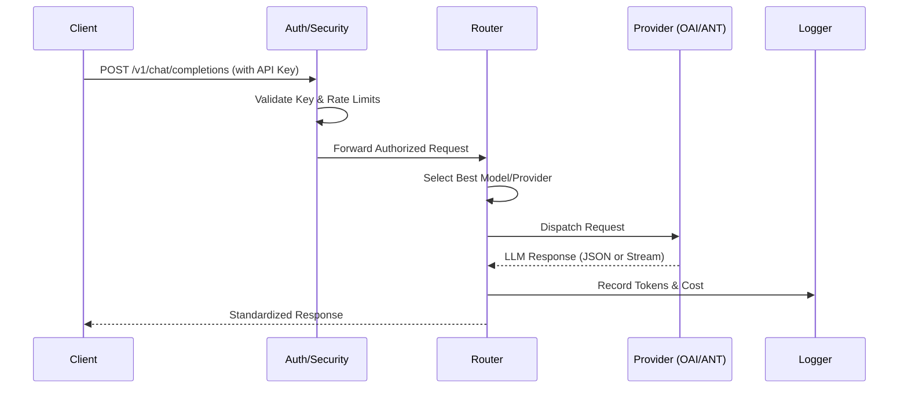
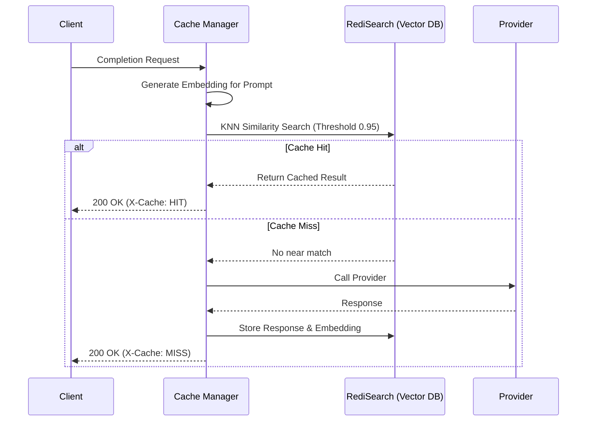
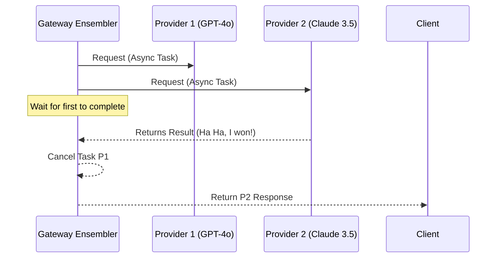

# 🏗️ Architectural Overview

The Universal LLM Gateway is designed for high-throughput, low-latency LLM orchestration with an emphasis on enterprise security and observability.

## 📐 Layered Architecture

The system is composed of five distinct layers:

1. **Ingress Layer**: FastAPI routes, standardizing OpenAI-compatible requests.
2. **Guardrail Layer**: Auth middleware, rate limiting, and prompt safety scrubbing.
3. **Intelligence Layer**: Semantic caching and the routing engine.
4. **Adapter Layer**: Provider-specific logic (OpenAI, Anthropic, Bedrock) with circuit breakers.
5. **Observability Layer**: Prometheus metrics, OpenTelemetry tracing, and structured logging.

---

## 🔄 Request Lifecycle (Sequence Diagrams)

### 1. Standard Request Flow

This diagram illustrates the standard path for a non-cached completion request.

### 2. Semantic Cache Flow

How the gateway recovers responses from the vector database without calling the LLM provider.

### 3. Model Ensembling (Race Flow)

This illustrates the "Fastest Wins" logic used for ultra-low latency requirements.

---

## 🛠️ Component Interactions

- **Redis**: Acts as the ephemeral storage for rate limit buckets, exact-match caching, and distributed circuit breaker states.
- **RediSearch**: Extends Redis with vector indexing for semantic similarity search.
- **PostgreSQL**: Stores persistent data: API keys, tenant budgets, and historical request logs.
- **OpenTelemetry**: Proxies tracing spans to Jaeger or Zipkin for cross-service observability.
