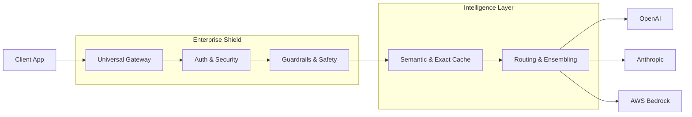

<div align="center">

# 🌌 Universal LLM Gateway

**A production-grade, enterprise-ready unified API for multiple LLM providers.**

[](https://fastapi.tiangolo.com/)
[](https://redis.io/)
[](https://www.postgresql.org/)
[](https://www.docker.com/)
[](https://opentelemetry.io/)

---

### *Seamlessly bridge the gap between your apps and OpenAI, Anthropic, & AWS Bedrock.*

[**Explore Technical Docs**](docs/README.md) • [**Usage Guide**](docs/USAGE_GUIDE.md) • [**API Reference**](docs/API_REFERENCE.md)

</div>

---

## ✨ Key Features

- 🛠️ **Unified API Interface**: Single OpenAI-compatible endpoint for all your LLM needs.
- 🚀 **Model Ensembling**: Concurrent model execution ("Racing") to guarantee speed and reliability.
- 🧠 **Semantic Caching**: Intelligent vector similarity search powered by RediSearch.
- 🛡️ **Prompt Safety Shield**: Real-time protection against malicious prompt injections.
- 💰 **Financial Budgeting**: Tenant-level daily USD spend limits and live cost tracking.
- 🚥 **Distributed Resilience**: Circuit breaker patterns to isolate vendor outages.
- 📊 **Observability Core**: Built-in OpenTelemetry tracing, Prometheus metrics, and structured JSON logs.
- 🔑 **Enterprise Security**: Argon2id key hashing and multi-tenant isolation.

---

## 🛠️ Quick Start

### 1. Prerequisites

Ensure you have **Docker** and **Docker Compose** installed.

### 2. Launching the Stack

The gateway comes pre-configured with a full observability and database stack.

```bash
# Clone and enter the project
git clone <repository-url>
cd universal-llm-gateway

# Start everything
docker-compose up -d
```

### 3. Verification

Check if the gateway is running:

```bash
curl http://localhost:8000/health
```

---

## 🏗️ Architecture at a Glance

The gateway follows a **Domain-Driven Design (DDD)** approach, optimized for high throughput and low latency.



---

## 📚 Documentation Portal

We maintain an exhaustive documentation suite covering every aspect of the project:

- 🏗️ **[Architectural Deep-Dive](docs/ARCHITECTURAL_OVERVIEW.md)**: Request lifecycles and sequence diagrams.
- 📂 **[Codebase Map](docs/CODEBASE_MAP.md)**: Detailed technical summaries for every file and folder.
- 🚀 **[Enterprise Feature Guide](docs/ENTERPRISE_FEATURES.md)**: How Semantic Caching and Ensembling work.
- 🛡️ **[Security Model](docs/SECURITY_MODEL.md)**: Threat mitigation and encryption standards.
- 🛠️ **[Development](docs/DEVELOPMENT_GUIDE.md) & [Deployment](docs/DEPLOYMENT_GUIDE.md)**: Guides for engineers and devops professionals.

---

## 🚥 Monitoring & Observability

- **API Documentation**: [http://localhost:8000/docs](http://localhost:8000/docs)
- **Distributed Tracing (Jaeger)**: [http://localhost:16686](http://localhost:16686)
- **Metrics (Prometheus)**: [http://localhost:8000/metrics](http://localhost:8000/metrics)

---

## 🏢 Enterprise Support

The Universal LLM Gateway is designed for large-scale deployments requiring high-availability, cost-control, and centralized security.

- **Zero-Trust**: Every request is authenticated and authorized.
- **Cost Efficiency**: Semantic caching can reduce provider bills by up to 80% for repetitive workloads.
- **Compliance**: Structured logging and PII redaction ensure your data handling meets regulatory standards.

---

<div align="center">

Developed with ❤️ for the AI community.
**[Contributing](CONTRIBUTING.md)** • **[Code of Conduct](CODE_OF_CONDUCT.md)** • **[License](LICENSE)** • **[Report a Bug](.github/ISSUE_TEMPLATE/bug_report.md)** • **[Request a Feature](.github/ISSUE_TEMPLATE/feature_request.md)**

</div>
